# Library Management System

A full-stack **Library Management System** built with **PHP** and **MySQL**. It provides a complete back-office for a library — managing books, authors, publishers, members, staff and periodicals, along with the full book-circulation workflow (issue, return, renew) and automatic fine calculation for overdue items.

Built as my Semester 4 DBMS project, the application is organised around a relational schema of 15+ tables and a clean, Bootstrap-based admin interface. An admin signs in, lands on a statistics dashboard, and manages the entire catalogue and membership from a single sidebar-driven UI. Every data table supports search, sorting and pagination, and book stock is tracked down to individual physical copies.

## Screenshots

### Dashboard
At-a-glance statistics (total / available / borrowed / overdue books), recent activity, quick actions and live notifications.

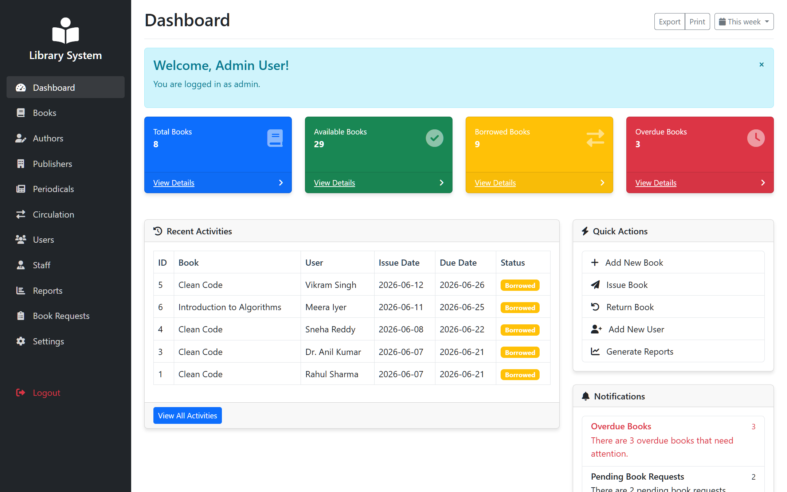

### Login
Session-based authentication with hashed passwords.

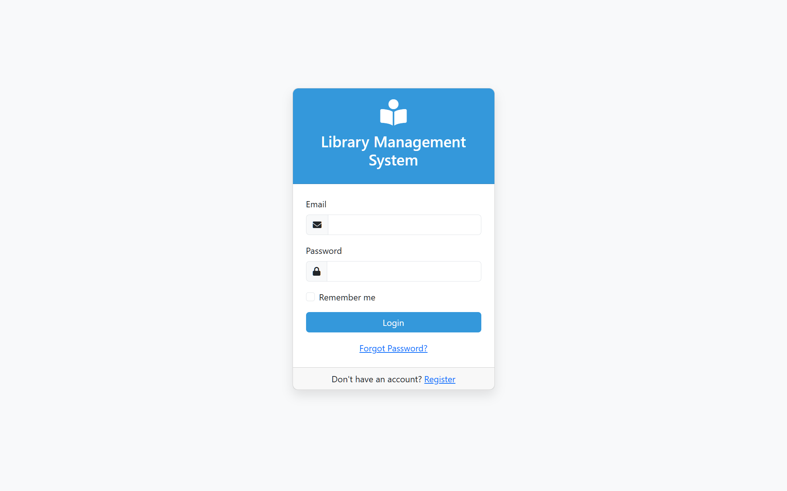

### Books Management
Full catalogue with authors, publishers, ISBN, genre, and per-title copy/availability counts.

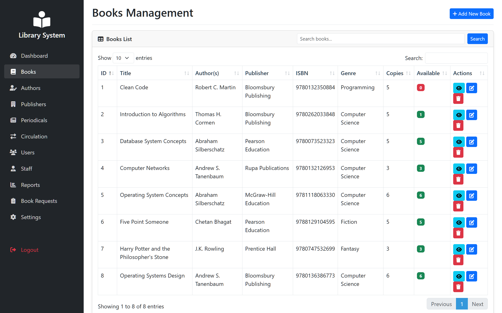

### Circulation
Issue, return and renew workflow with live status badges and automatic overdue fine calculation.

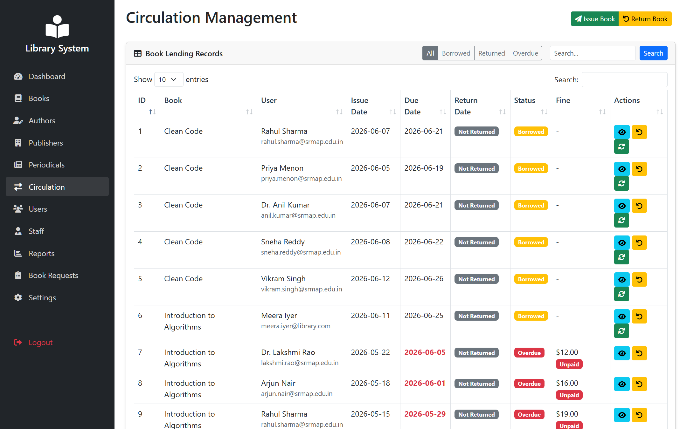

### Reports
Circulation, user-activity, fine, inventory and request reports with summary cards and an activity chart.

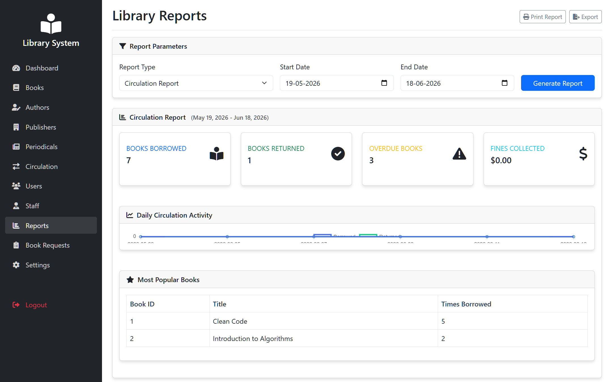

| Authors | Publishers |
| :---: | :---: |
| 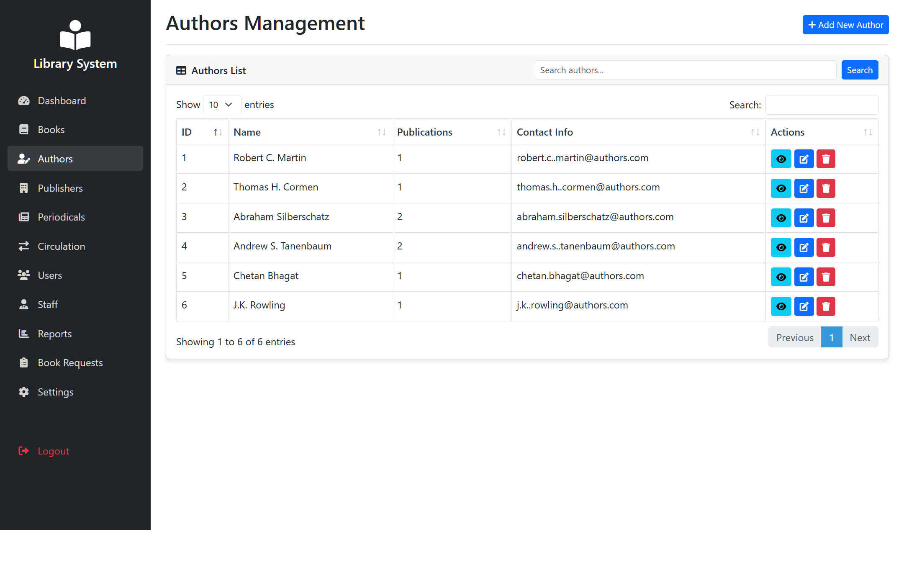 | 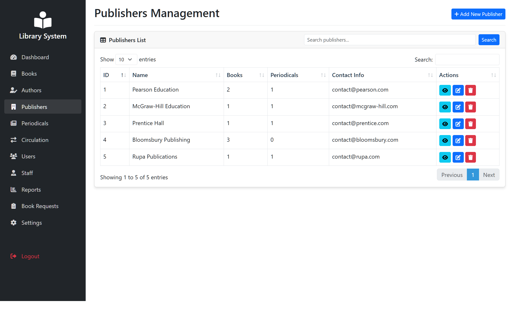 |

| Periodicals | Book Requests |
| :---: | :---: |
| 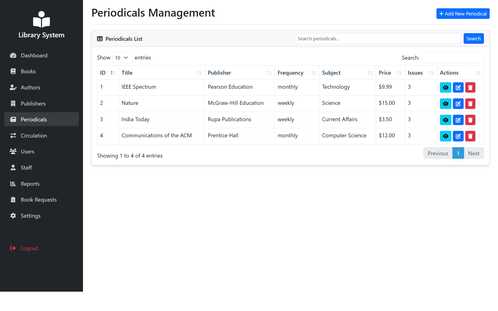 | 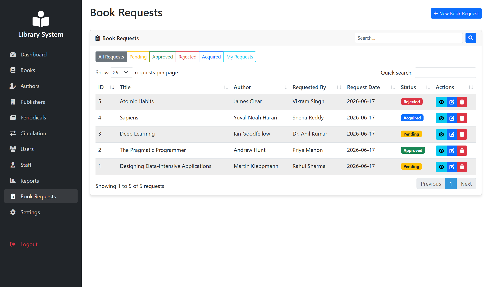 |

| Members | Staff |
| :---: | :---: |
| 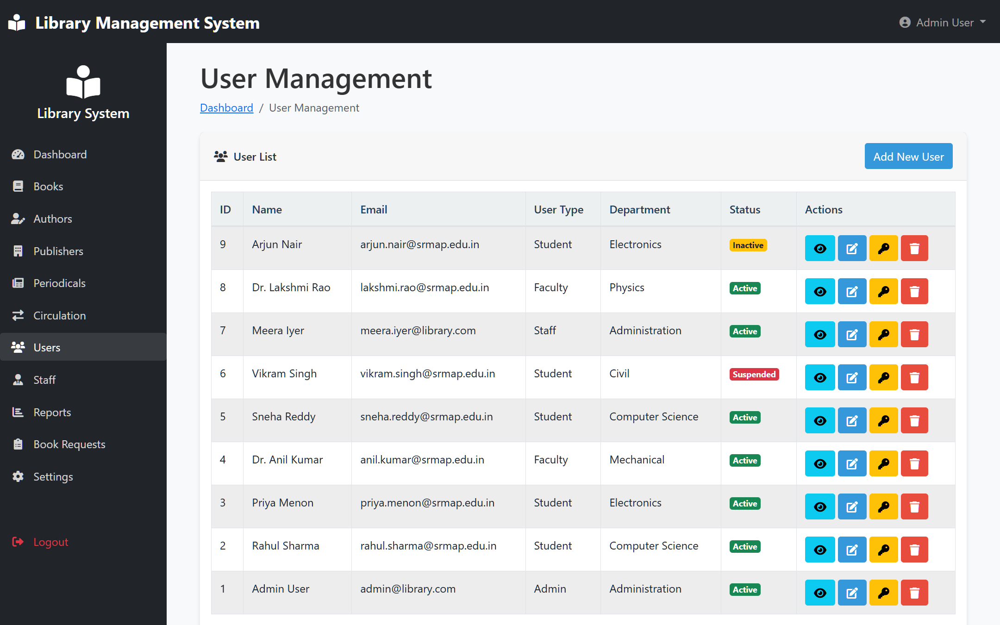 | 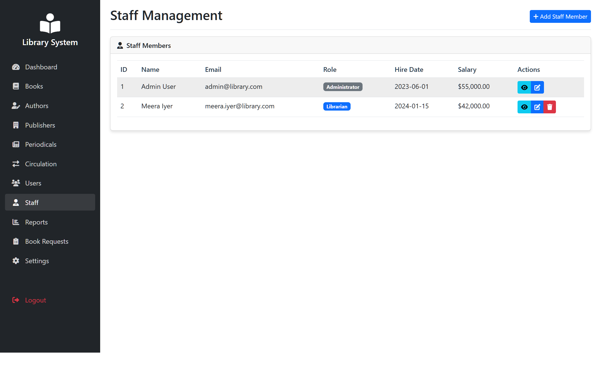 |

## Features

- **Authentication & roles** — secure login with `password_hash()` and admin / staff / member access levels.
- **Dashboard** — totals for books, availability, active loans and overdue items, plus recent activity and notifications.
- **Book management** — add, edit, delete and search books; track individual physical copies (condition, location, status).
- **Authors & publishers** — full CRUD and many-to-many association with books.
- **Member management** — students, faculty, staff and admin accounts with status (active / inactive / suspended).
- **Circulation** — issue, return and renew books with automatic overdue fine calculation.
- **Book requests** — members request acquisitions; staff approve, reject or mark as acquired.
- **Periodicals** — manage journals/magazines and their individual issues.
- **Reports** — circulation statistics, inventory breakdowns and library usage data.

## Tech Stack

- **Backend:** PHP (PDO for database access)
- **Database:** MySQL / MariaDB
- **Frontend:** HTML, CSS, Bootstrap 5, JavaScript, jQuery, DataTables
- **Server:** Apache (via XAMPP)

## Project Structure

```
DBMS_Project/
├── index.php             # Dashboard / landing page
├── login.php             # Authentication
├── logout.php
├── config.php            # Database connection & helper functions
├── books.php             # Book management
├── authors.php           # Author management
├── publishers.php        # Publisher management
├── periodicals.php       # Periodicals & issues
├── circulation.php       # Issue / return / renew
├── book_requests.php     # Acquisition requests
├── users.php             # Member/user management
├── staff.php             # Staff management
├── reports.php           # Reports & statistics
├── settings.php
├── setup_admin.php       # First-run admin/database setup helper
├── get_*.php             # AJAX endpoints (dashboard stats, book lookup, etc.)
├── library_schema.sql    # Full database schema
├── css/                  # Stylesheets
├── js/                   # Client-side scripts
├── includes/             # Shared header & sidebar
└── docs/screenshots/     # UI screenshots used in this README
```

## Getting Started

> Full step-by-step instructions are in [SETUP_GUIDE.md](SETUP_GUIDE.md).

1. Install [XAMPP](https://www.apachefriends.org/) and start **Apache** and **MySQL**.
2. Place this project inside your `htdocs` directory.
3. Import `library_schema.sql` through phpMyAdmin to create the `library_management_system` database.
4. Adjust the credentials in `config.php` if your MySQL setup differs from the XAMPP defaults.
5. Visit `setup_admin.php` once to create the database (if needed) and the initial admin user.
6. Open `login.php` in your browser and sign in.

**Default admin credentials**

| Email | Password |
| --- | --- |
| admin@library.com | admin123 |


## Database

The schema (`library_schema.sql`) defines the core tables: `books`, `authors`, `publishers`, `users`, `staff`, `book_copies`, `book_lending`, `book_requests`, `book_reservations`, `periodicals`, `periodical_issues` and supporting tables for reviews and statistics. Relationships between books, authors and publishers are modelled as many-to-many join tables, and circulation links members to individual book copies.

## License

Released under the [MIT License](LICENSE).
